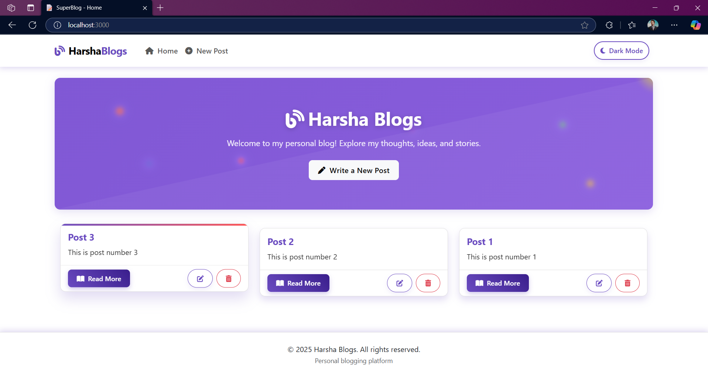
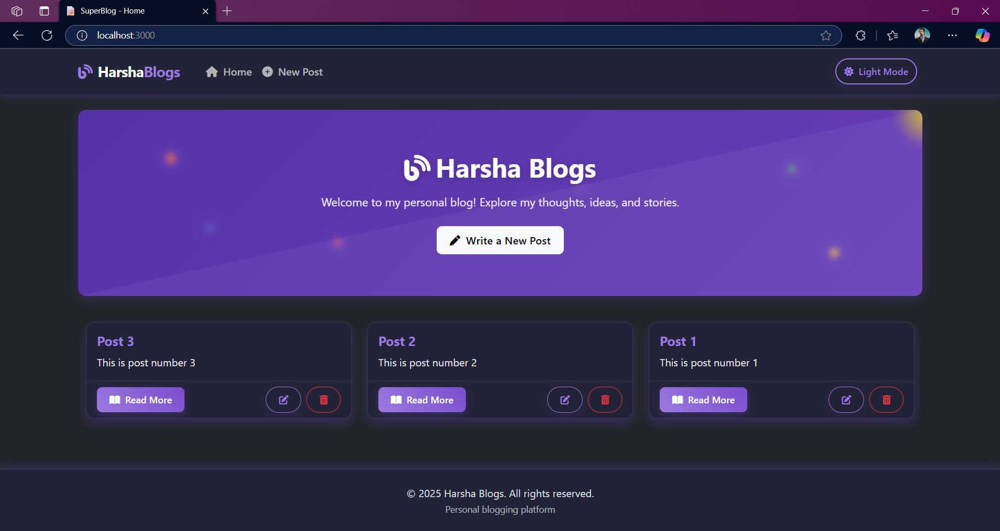
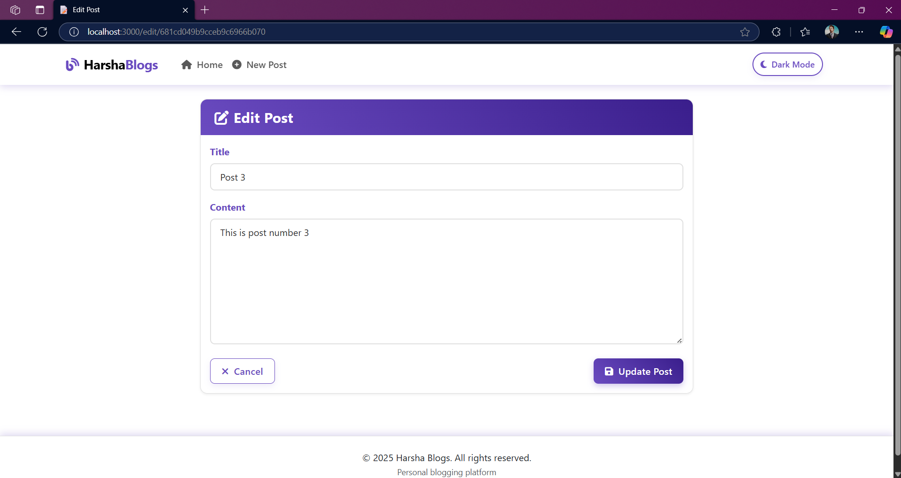

# Harsha Blogs

A modern, responsive, and feature-rich blogging platform built with Node.js and Express. This application provides a clean and intuitive interface for creating, editing, and managing blog posts with a beautiful Avengers Endgame-inspired theme.

## Screenshots

### Light Mode


### Dark Mode


### Editing a Post


## Features

- **Modern UI with Avengers Theme**: Enjoy a beautiful, responsive user interface with animations inspired by the Avengers movies
- **Dark/Light Mode**: Toggle between dark and light themes with a smooth transition
- **CRUD Operations**: Create, read, update, and delete blog posts
- **In-Memory Database**: Uses MongoDB Memory Server for quick setup without external database dependencies
- **Responsive Design**: Optimized for mobile, tablet, and desktop views
- **Loading Animations**: Smooth transitions between pages with custom loading animations
- **EJS Templating**: Organized view structure with layouts and partials using EJS

## Tech Stack

- **Frontend**: HTML, CSS, JavaScript, Bootstrap 5
- **Backend**: Node.js, Express.js
- **Database**: MongoDB (in-memory using mongodb-memory-server)
- **View Engine**: EJS with express-ejs-layouts
- **Dependencies**:
  - express
  - mongoose
  - dotenv
  - body-parser
  - express-ejs-layouts
  - ejs
  - mongodb-memory-server (for development)

## Getting Started

### Prerequisites

- Node.js (v14.x or higher)
- npm (v6.x or higher)

### Installation

1. Clone the repository
   ```bash
   git clone https://github.com/yourusername/blog_web_app.git
   cd blog_web_app
   ```

2. Install dependencies
   ```bash
   npm install
   ```

3. Create a `.env` file in the root directory (optional)
   ```
   PORT=3000
   ```

4. Start the application
   ```bash
   npm start
   ```
   
   For development with auto-reload:
   ```bash
   npm run dev
   ```

5. Open your browser and navigate to `http://localhost:3000`

## Project Structure

```
blog_web_app/
├── app.js                # Main application file
├── package.json          # Project dependencies and scripts
├── .env                  # Environment variables
├── .gitignore            # Git ignore file
├── public/               # Static files
│   ├── styles.css        # Main stylesheet
│   └── images/           # Image assets
├── screenshots/          # Application screenshots
│   ├── homepage_light_mode.png
│   ├── homepage_dark_mode.png
│   └── editing_post.png
└── views/                # EJS templates
    ├── create.ejs        # Create post form
    ├── edit.ejs          # Edit post form
    ├── index.ejs         # Homepage
    ├── layout.ejs        # Main layout template
    └── post.ejs          # Single post view
```

## Usage

### Creating a Post
1. Click on the "Write a New Post" button on the homepage or "New Post" in the navigation menu
2. Fill in the title and content fields
3. Click "Publish Post" to save your blog post

### Editing a Post
1. Click on the edit icon on any post card or use the edit button on the post page
2. Modify the content as needed
3. Click "Update Post" to save your changes

### Deleting a Post
1. Click on the delete icon on any post card or use the delete button on the post page
2. Confirm deletion when prompted

## Development

For development, this application uses mongodb-memory-server to avoid the need for a separate MongoDB installation.

When running in development mode with `npm run dev`, nodemon will automatically restart the server when changes are detected.

## Deployment

For production deployment:

1. Set up a MongoDB instance (Atlas, self-hosted, etc.)
2. Update the connection string in app.js
3. Set up proper environment variables
4. Deploy to your preferred hosting platform (Heroku, Vercel, AWS, etc.)

## Contributing

Contributions are welcome! Please feel free to submit a Pull Request.

1. Fork the repository
2. Create your feature branch (`git checkout -b feature/amazing-feature`)
3. Commit your changes (`git commit -m 'Add some amazing feature'`)
4. Push to the branch (`git push origin feature/amazing-feature`)
5. Open a Pull Request

## License

This project is licensed under the ISC License - see the LICENSE file for details.

## Acknowledgements

- [Bootstrap](https://getbootstrap.com/)
- [Express.js](https://expressjs.com/)
- [MongoDB](https://www.mongodb.com/)
- [EJS](https://ejs.co/)
- [Font Awesome](https://fontawesome.com/)